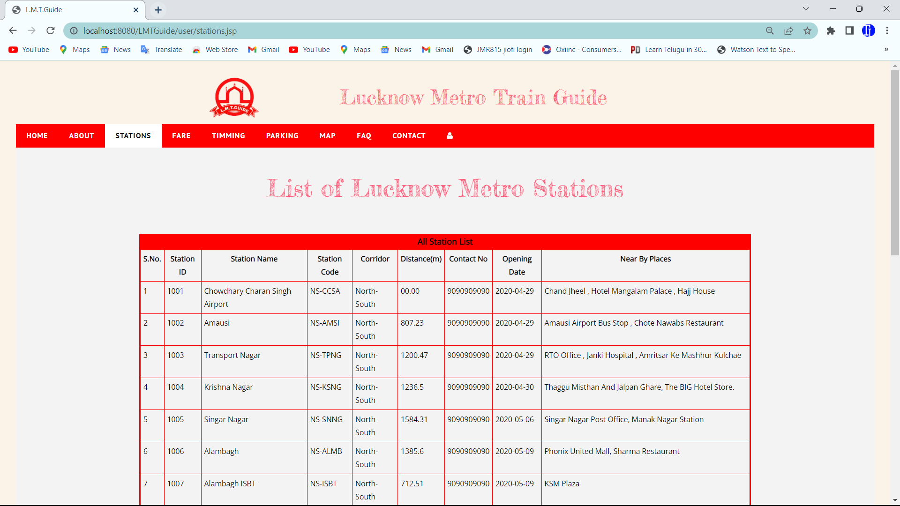

# Lucknow Metro Train Guide (LMT Guide)
---
> **Introduction**
>The Lucknow Metro is a Mass Rapid Transit System (MRTS) being constructed to provide the city of Lucknow, Uttar Pradesh with an environment friendly atmosphere. Lucknow Metro Rail Corporation Limited or LMRC is working on this project which will be an alternative mode of transport since approximately 94% of the city's registered vehicles are private, city had over 2 million registered vehicle in 2015. According to a report every month city is adding about 1000 new four wheelers in its vehicle population. Growing population and huge traffic has called for the transformation of private modes of conveyance to public transport.
> So, I designed this website to facilitate users and provide them with all the information about Lucknow Metro, including timings, fares, and stations. We aim to provide free access to all the information without any charges.

>**Hardware & Software Requirement:**
>|Hardware   | Description |
>|:------| :--------: |
>|Hard Disk|120 GB and above|
>|RAM| 4 GB and above| 
>
>|Software   | Description |
>|:------| :--------: |
>|Operating System|Windows XP, 7 and others|
>|Front End| HTML, CSS & Boot Straps| 
>|Back End| JDBC, JSP, Servlet| 
>|Data Base| MYSQL| 
>|Designing Tool| Eclipse IDE| 
>|Scripting Language| JavaScript and jQuery| 
>|Browser| Google Chrome| 
>|Server| apache-tomcat-7.0.109| 

## User Modules
>This feature allows users to see the information about Lucknow Metro Train and file feedback through the application. The user does not require a registration. He can give his name, email-id, phone number, address and other details along with the complaints. The admin will look to the feedback sent by user.
>- ### Home Page
>This module provides the information related to the station between the source to destination. And also shows the distance between source and destination and show nearby places of that station.
>
>
>
>
>- ### About Page
>
>
>- ### Station Page
>Station Information Management provides all information related to the metro station, such as the Station ID (a unique identifier for the station), Station name, Station Code (a unique code for the station), Corridor (which defines the corridor of the station, such as north-south or east-west), distance (in meters) of the station from the starting station of the metro train, contact number of the station, opening date of the station, and nearby places from the station.
>
>
>
>- ### Ticket Fare Page
>The ticket fare system of the Lucknow Metro train is designed to calculate fares based on the distance traveled between stations. The fare is calculated by the Automatic Fare Collection (AFC) system, which reads the smart cards used by passengers when they enter and exit the train stations.
>
>
>
>- ### Timming Page
>The train timing management provides information about the first and last train timings, where the first train timing contains information about the first train departing from the source to the destination, and the last train timing contains information about the last train departing from the source to the destination.
>
>
>
>- ### Parking Page
>This module shows the parking fees at the Lucknow Metro train stations, with rates starting from 5 rupees to 20 rupees depending on the type of vehicle, and the price varies with the duration of parking.
>
>
>
>- ### Map Page
>The route map of the Lucknow Metro train provides a visual representation of the train's route and stations. The map shows two metro lines: the North-South corridor, which connects Chaudhary Charan Singh International Airport to Munshipulia, and the East-West corridor, which connects Charbagh Railway Station to Vasant Kunj.
>
>
>
>- ### Contact Page
>A user contact module for site problems is a software component that enables users to report technical issues or problems related to a website or web application. The module typically consists of a form that users can fill out to provide detailed information about the issue they are experiencing. The form usually requires users to provide their name, email address, and a description of the problem they are experiencing. Our team provide solution to the user.
>
>

## Admin Modules
>This feature allows the admin to view and reply to complaints. Admin can add stations, routes, train, and trip. Admin can also add and update fare details, and even add a new admin. Actually, the admin is a panel consisting of a group of authorized persons.
>- ### Admin Login Page
>
>- ### Dashboard Page
>
>
>- ### Add Station Page
>
>
>- ### Parking Charges Page
>
>
>- ### View Contact Page
>

>chandan maurya

